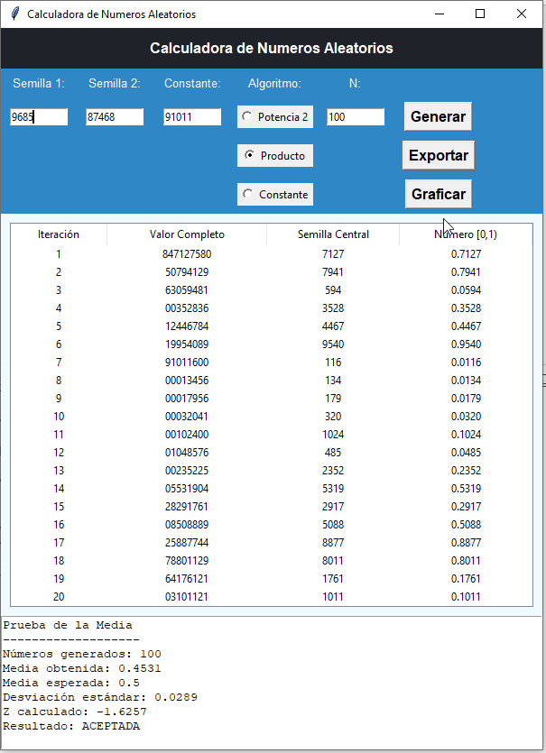

# Calculadora de Números Pseudoaleatorios

Esta aplicación permite generar números pseudoaleatorios mediante tres algoritmos distintos y analizar su calidad estadística. Además, ofrece opciones de **exportación a Excel**, **gráfica de dispersión** y **prueba de la media**.

---

## Funcionalidades

1. **Generación de números pseudoaleatorios** mediante:
   - Potencia al cuadrado (usando semilla 1)
   - Producto de dos semillas (semilla 1 y semilla 2)
   - Producto con constante (semilla 1 y constante)
2. **Visualización de resultados**:

   - Tabla con iteración, valor completo, semilla central y número [0,1).

3. **Exportación a Excel**:
   - Botón `Exportar` que genera un archivo `.xlsx` con todos los resultados.
4. **Gráfica de dispersión**:

   - Botón `Graficar` que muestra un dispersograma de iteración vs número pseudoaleatorio.

5. **Prueba de la media**:
   - Evalúa la uniformidad de los números generados.
   - El informe se muestra en un panel debajo de la tabla.

---

## Requisitos

- Python 3.8 o superior

### Librerías utilizadas

| Librería     | Función / Uso                                   |
| ------------ | ----------------------------------------------- |
| `tkinter`    | Creación de la interfaz gráfica                 |
| `ttk`        | Widgets avanzados de Tkinter                    |
| `matplotlib` | Generación de gráficos (dispersograma)          |
| `openpyxl`   | Exportación de datos a Excel (.xlsx)            |
| `math`       | Cálculos matemáticos para la prueba de la media |
| `os`, `sys`  | Abrir archivos automáticamente según el sistema |

---

## Estructura del proyecto


```
Calculadora
│
├── principal.py # Archivo principal para la construccion de la aplicacion
├── formularios/
│ └──frm_maestro.py #Archivo del Formulario principal
├── util/
│ └── util_ventana.py #Utilitarios de ventana
│ └── util_calculos.py #Utilitarios de calculo
│ └── exporter.py #Programa para exportar
└── README.md

## Uso

1. Ejecutar `main.py`:

```bash
python main.py

```
## Captura de Pantallas del Sistema



Autor
Nombre: Elvis Roger Anavi Jimenez
Fecha: 9 de sept 2025
